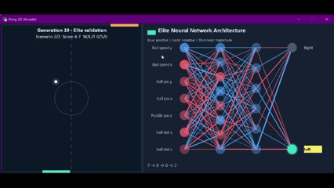

# AI-Pong

[](https://github.com/CodeRSTech/AI-Pong/actions/workflows/ci.yml)
[](https://www.python.org/)
[](LICENSE)

AI-Pong uses a genetic algorithm to evolve neural networks that play Pong. Each generation evaluates a population in parallel with batched PyTorch inference; Arcade displays the current population's representative game and network.

**Documentation:** [Read the AI-Pong docs](https://coderstech.github.io/AI-Pong/)

> **Demo GIF:** Not captured yet. See the [feature tracker](#feature-tracker) for how to add one.

<!-- Demo capture planned: add  here when a gameplay GIF is recorded. -->

## Quick start

Requires Python 3.10 or newer. From the repository root:

```bash
python -m venv .venv
```

Activate the virtual environment (`.venv\Scripts\Activate.ps1` in PowerShell or `source .venv/bin/activate` on macOS/Linux), then install dependencies:

```bash
python -m pip install --upgrade pip
python -m pip install -r requirements.txt
```

Run the genetic algorithm:

```bash
python -m src.main
```

To watch a saved elite model, first run training so `elite_model.pt` is saved in the current directory, then run:

```bash
python -m src.tester
```

Training runs for up to 1,000 generations with a population of 200. Each generation runs for 12 seconds by default. Each run creates a timestamped folder under `runs/` containing settings, per-generation metrics, and checkpoints. Use `python -m src.main --help` to see CLI options. `python -m src.tester` loads the latest run's elite; use `--checkpoint` to select a specific model.

## Configuration

Defaults in `src/variables.py`:

| Setting | Default | Description |
| --- | ---: | --- |
| `WIDTH` | `476` | Width of the play area, in pixels. |
| `HEIGHT` | `500` | Height of the play area, in pixels. |
| `FPS` | `144` | Base Arcade update rate; multiplied by `SPEED` to determine the window update rate. |
| `TIME_OUT` | `12` | Generation duration in seconds. Use `-1` for an unbounded interactive game. |
| `SPEED` | `2.5` | Update-rate and paddle movement speed multiplier. |
| `STEPS_PER_FRAME` | `15` | Simulation steps evaluated on each Arcade update. |
| `PANEL_WIDTH` | `640` | Width of the neural-network visualization panel. |

The approximate simulation workload is `FPS × SPEED × STEPS_PER_FRAME` steps per second; the per-step time increment keeps the timeout in elapsed seconds. Population size, generations, seed, timeout, rendering, and timing values can be set from the training CLI; see `python -m src.main --help`. The GA's elite/crossover rates and mutation settings are defined in `src/ga/ga_core.py` and `src/ga/network.py`.

## FAQ

**Scores stop improving. What should I try?**

Increase `TIME_OUT` in `src/variables.py` to give each generation more time to play. Training behavior can also vary with the initial population and random seed.

**Where are my training runs saved?**

Each run is saved under `runs/<timestamp>/`, including `settings.json`, `metrics.csv`, the elite checkpoint, and top generation checkpoints. Use `python -m src.tester` to watch the newest elite.

**How do I run the tests?**

Install the development extras with `python -m pip install -e ".[dev]"`, then run `pytest`.

## Feature tracker

| Feature | Status |
| --- | --- |
| Batched population inference and neural-network visualization | Available |
| Per-run folders with settings and training metrics | Planned |
| Gameplay demo GIF | Capture planned |

To add the demo, record a short gameplay session (showing both the play area and network panel), trim it to a few seconds, resize/optimize it as a GIF, and save it as `assets/demo.gif`. Then replace the demo-capture comment near the top of this README with an image link to that file.

## Contributing

See [CONTRIBUTING.md](CONTRIBUTING.md) for development setup, tests, and pull-request guidance. Report bugs or request features using the [repository issue templates](https://github.com/CodeRSTech/AI-Pong/issues/new/choose).
