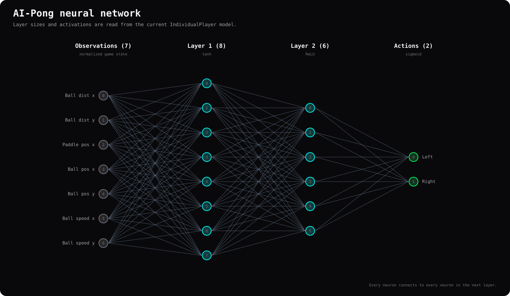

# AI-Pong

[](https://github.com/CodeRSTech/AI-Pong/actions/workflows/ci.yml)
[](https://www.python.org/)
[](LICENSE)

AI-Pong uses a genetic algorithm to evolve neural networks that play Pong. Each generation evaluates a population in parallel with batched PyTorch inference; Arcade displays the current population's representative game and network.

**Documentation:** [AI-Pong homepage](https://coderstech.github.io/AI-Pong/) | [Read the AI-Pong docs](https://coderstech.github.io/AI-Pong/docs/) | [Release 1.4.0 details](docs/releases/1.4.0.md)


## How it works

Each candidate AI is a fully connected **7 → 8 → 6 → 2** neural network:
seven normalized game observations enter two hidden layers, and the two
outputs choose whether to move the paddle left or right. The network uses
PyTorch; NumPy provides observation and batch-input arrays. Arcade supplies
the 2D window, event loop, and rendering, while headless training uses the
same simulation without opening a window.

After each generation, the genetic algorithm ranks players by fitness,
retains and probabilistically selects survivors, crosses pairs of parents,
then mutates offspring to form the next population. The current two-point
crossover swaps a contiguous interval of neurons and associated weights and
biases between parents, producing reciprocal children; the
[architecture guide](docs/architecture.md#selection-crossover-and-mutation)
explains the details and shows the crossover schematic. The
[fitness guide](docs/fitness.md) describes how candidate players are scored.



The [architecture guide](docs/architecture.md) includes a source-driven
crossover diagram. Regenerate both diagrams from the repository root with
`python -m scripts.generate_diagrams`.

The animation scenes share a terminal-inspired palette and grid treatment:
near-black background, charcoal cards, subtle borders, and cyan/green
highlights. Crossover parent ownership uses cyan for Parent A and green for
Parent B. Signed activations in **every** network animation, and signed
checkpoint weights, retain blue for positive and pink/coral for negative;
zero is neutral. These meanings are separate from the cyan/green donor palette.

### Source-driven gameplay animation modules

Three optional Manim scenes explain a **single recorded decision** in separate
clips: gameplay state to the seven normalized observations; those observations
through the actual network and sigmoid action thresholds; and the selected
action through the real paddle movement and following simulation states. All
three read the same trace and decision index. The trace includes the selected
checkpoint's SHA-256, network weights/biases once, each decision's state,
observations, activations, actions, and post-step state.

Capture only from an explicitly supplied checkpoint; this command does not
search `runs/`, select a changing elite, or substitute a fresh random model:

```powershell
python -m scripts.capture_gameplay_trace --checkpoint D:\models\selected-generation.pt --seed 42 --steps 90 --run-id selected-run --generation 12 --validation-json D:\animation-work\validation-summary.json --output D:\animation-work\gameplay-trace.json
```

`--validation-json` is optional and must contain a JSON object. If run,
generation, or validation provenance is unavailable, it is recorded as
`unknown`; the checkpoint hash and capture settings are still recorded. The
trace step delta defaults to the rendered game's configured timing and can be
overridden with `--step-delta`. Capture is bounded to 1–1000 decisions, uses
`Game.step`, and restores Python, NumPy, and PyTorch RNG state after recording.
Single-network cached outputs are checked against batched gameplay inference.

Render all three from the same trace and chosen decision:

```powershell
.\.venv\Scripts\python.exe -m scripts.render_animations --scenes observations network-actions actions-execution --trace D:\animation-work\gameplay-trace.json --decision-index 12 --quality l --output-dir D:\animation-work\preview
```

Use an explicit checkpoint copy and inspect preview frames before choosing a
decision or publishing media. The example is presentation selection, not a
reliability evaluation. A suitable trained demonstration is not assumed imminent:
the reported two-hour run still scored below the CPU. Training time does not
guarantee a strong or optimal player. The tooling is ready, but the three
trained-game clips and their embedded assets remain deferred. Follow the
[future checkpoint-to-animation workflow](docs/architecture.md#future-checkpoint-to-animation-workflow)
when a model and its evaluation evidence are available; it covers preservation,
provenance, capture settings, preview review and final rendering.
Temporary seeded checkpoints
are suitable for tests and local layout previews only; they are not trained
gameplay and must not be published as such.

### Planned combined decision-cycle animation

A future combined clip will compose the three modules using the **same
checkpoint, trace, and selected decision**. It will establish the recorded
court state; freeze the simulation while deriving and labeling observations;
move those exact inputs into the network; reveal actual layer activations and
sigmoid thresholds; apply the recorded action; then resume the next recorded
`Game.step` and repeat. An end-to-end timeline will label simulation-step
numbers and distinguish actual simulation steps from the longer visual
explanation pauses. It will not splice states from unrelated episodes into a
fictional causal chain. This combined clip is planned, not delivered.

### Planned generation-lifecycle animation

A separate future clip will explain one recorded training generation in source
order: initial population creation; one play zone per individual; batched
inference during parallel evaluation; fitness components and ranking; checkpoint
and metrics writes before elite validation; fresh randomized validation and its
informational success signal; elite duplication and probabilistic selection;
population restoration; mating-pool construction; independent crossover cuts;
offspring mutation and replacement; and the next generation. Recorded
run/generation artifacts will supply displayed numbers; purely conceptual
transitions will be labeled as such.

The lifecycle must distinguish the generation's fitness winner, validation
achievement, the gameplay representative shown in the rendered window, and a
best-ever model (which the current implementation does not maintain). It must
not imply that validation success stops training or that the displayed player
is necessarily the fitness winner. This lifecycle animation is planned, not
delivered.

**Animated explanations:** watch the
[network forward pass](https://coderstech.github.io/AI-Pong/docs/architecture/#neural-network-animation)
and [two-point crossover](https://coderstech.github.io/AI-Pong/docs/architecture/#crossover-animation)
in the architecture guide. These are illustrative, source-driven examples,
not footage of a trained elite. See the
[rendering instructions](docs/architecture.md#regenerating-the-animations)
to regenerate the clips with optional Manim tooling.

<!-- Image placeholders: replace these notes with captured assets when available. -->
> **Gameplay screenshot placeholder:** Add a capture of the rendered court during training.
>
> **Network panel screenshot placeholder:** Add a close view of the live network visualization.

## Quick start

Requires Python 3.10 or newer. From the repository root:

```bash
python -m venv .venv
```

Activate the virtual environment (`.venv\Scripts\Activate.ps1` in PowerShell or `source .venv/bin/activate` on macOS/Linux), then install dependencies:

```bash
python -m pip install --upgrade pip
python -m pip install -r requirements.txt
```

Run the rendered genetic algorithm:

```bash
python -m src.main
```

Rendered games use synthesized paddle-hit, wall-bounce, and scoring sounds by default. Disable audio with `python -m src.main --no-sound` or `python -m src.tester --no-sound`; headless training remains silent.

Run headless training with periodic progress output:

```bash
python -m src.train
```

Both commands train continuously until interrupted by `Ctrl+C`; use `--generations` to set a limit. Each generation validates its elite on 2 fresh scenarios by default; use `--validation-games 20` for a larger suite. The rendered runner shows a green border once an elite wins at least 95% of scenarios and shuts out the CPU in at least 90%; training continues after that target is reached. With only 2 scenarios, both must be wins and CPU shutouts; this small sample is not strong evidence of general reliability.

**For a more informative reliability assessment, use `--validation-games 20` or higher** with either training command. The default of 2 prioritizes quick developmental feedback; larger suites take longer, particularly when rendered.

To watch a saved elite model, run:

```bash
python -m src.tester
```

Each run creates a timestamped folder under `runs/` containing settings, per-generation metrics, validation results, and checkpoints. Use `python -m src.train --help` or `python -m src.main --help` to see CLI options. `python -m src.tester` loads the latest run's elite; use `--checkpoint` to select a specific model.

The saved elite is overwritten with each generation's fitness winner before
validation; it is not a best-ever model, guaranteed to meet the validation
target, or a resumable training checkpoint. Every invocation starts a fresh
population. See the [1.4.0 release notes](docs/releases/1.4.0.md) for exact
artifact schemas, CLI defaults, and migration details.

## Configuration

Defaults in `src/variables.py`:

| Setting           | Default | Description                                                                         |
|-------------------|--------:|-------------------------------------------------------------------------------------|
| `WIDTH`           |   `476` | Width of the play area, in pixels.                                                  |
| `HEIGHT`          |   `500` | Height of the play area, in pixels.                                                 |
| `FPS`             |   `144` | Base Arcade update rate; multiplied by `SPEED` to determine the window update rate. |
| `TIME_OUT`        |    `12` | Generation duration in seconds. Use `-1` for an unbounded interactive game.         |
| `SPEED`           |   `2.5` | Update-rate and paddle movement speed multiplier.                                   |
| `STEPS_PER_FRAME` |    `15` | Simulation steps evaluated on each Arcade update.                                   |
| `PANEL_WIDTH`     |   `640` | Width of the neural-network visualization panel.                                    |

The approximate simulation workload is `FPS × SPEED × STEPS_PER_FRAME` steps per second; the per-step time increment keeps the timeout in elapsed seconds. Population size, generations, seed, timeout, and timing values can be set from either CLI; see `python -m src.train --help`. Validation randomizes positions and ball direction, game duration (6–18 seconds), and paddle width (50–120 pixels). The GA's elite/crossover rates and mutation settings are defined in `src/ga/ga_core.py` and `src/ga/network.py`.

## FAQ

**Scores stop improving. What should I try?**

Increase `TIME_OUT` in `src/variables.py` to give each generation more time to play. Training behavior can also vary with the initial population and random seed.

**Where are my training runs saved?**

Each run is saved under `runs/<timestamp>/`, including `settings.json`, `metrics.csv`, the elite checkpoint, and top generation checkpoints. Use `python -m src.tester` to watch the newest elite.

**How do I run the tests?**

Install the development extras with `python -m pip install -e ".[dev]"`, then run `pytest`.

## Feature tracker

| Feature                                                                   | Status          |
|---------------------------------------------------------------------------|-----------------|
| Batched population inference and neural-network visualization             | Available       |
| High-contrast Arcade court, distinct paddles, and ball visibility effects | Available       |
| Generated paddle-hit, wall-bounce, and scoring sounds in rendered play    | Available       |
| Per-run folders with settings, metrics, validation, and checkpoints       | Available       |
| Randomized elite validation and ongoing-training success indicator        | Available       |
| Gameplay demo GIF                                                         | Available       |

To add the demo, record a short gameplay session (showing both the play area and network panel), trim it to a few seconds, resize/optimize it as a GIF, and save it as `assets/demo.gif`. Then replace the demo-capture comment near the top of this README with an image link to that file.

## Website and documentation publishing

The repository's GitHub Pages workflow publishes the project homepage at
<https://coderstech.github.io/AI-Pong/> and the MkDocs site at
<https://coderstech.github.io/AI-Pong/docs/>. On pushes to `main` or manual
dispatch, it builds the docs into `site/docs/`, adds the root `index.html`, and
deploys both as one Pages artifact.

Before the first deployment, configure **Settings → Pages → Build and
deployment → Source** to **GitHub Actions**. No cross-repository token is
needed.

To preview the docs locally, install `mkdocs` and `mkdocs-bootswatch`, then run
`mkdocs serve` from the repository root.

## Contributing

See [CONTRIBUTING.md](CONTRIBUTING.md) for development setup, tests, and pull-request guidance. Report bugs or request features using the [repository issue templates](https://github.com/CodeRSTech/AI-Pong/issues/new/choose).
