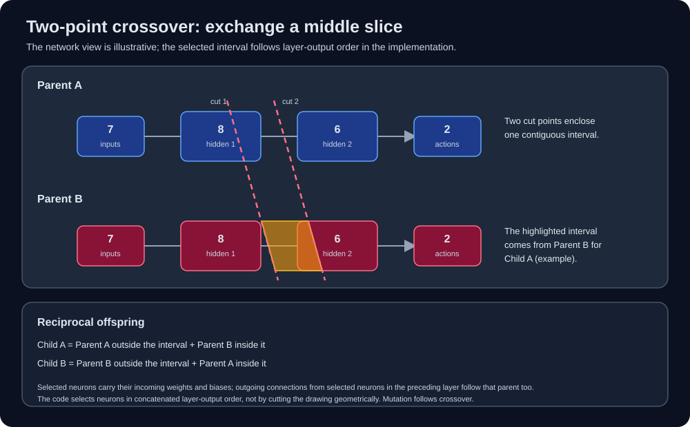

# Architecture

## Evolution loop

`src.main` creates an initial population of `IndividualPlayer` instances and
passes it to `GeneticAlgorithm` in `src/ga/ga_core.py`. Each individual owns a
neural network and one `PlayZone`. Every generation:

1. The population plays for the configured generation duration; each player is
   evaluated in its own simulation zone.
2. Fitness is calculated and the population is ranked. The fitness winner is
   checkpointed and tested on fresh validation scenarios (2 by default).
3. Selection and reproduction produce the next population.

Rendered training advances through this lifecycle in one Arcade window and
event loop. Updates perform bounded gameplay, fitness, or validation work so
the window can continue drawing and processing close events. Closing it
cancels an in-progress validation and prevents another generation from
starting. Headless training runs the same simulation synchronously without a
window.

The default population is 200. Training continues until interrupted unless
`--generations` sets a limit.

### Selection, crossover, and mutation

After ranking, the GA seeds a survivor pool with three copies of the top 10%
of the population (at least one elite). It also considers the current
individuals for probabilistic retention: fitter individuals have a higher
chance, using fitness scaled between the weakest and strongest individual in
the generation. When every fitness value is equal, the retention probability
is 0.1. The population is then filled or trimmed to its configured size.

The first 40% of the resulting population (at least two individuals, rounded
to an even number) forms the mating pool. Its members are paired in shuffled
order. Each pair produces two reciprocal offspring with
`two_point_crossover`: two cut points define a contiguous interval in the
ordered list of layer-output neurons. Within that interval, a child inherits
each selected neuron's incoming weights and bias from one parent; outside it,
those values come from the other. Connections leaving selected neurons in
the preceding layer are inherited from the same parent. The second offspring
reverses the parent roles. This is a neuron-level crossover, not a raw slice
through the flattened weight tensors.



The offspring are reset and mutated. Each network parameter independently
has a 0.1 probability of receiving Gaussian noise scaled by 0.2. Offspring
replace the tail of the selected pool, and the GA restores the configured
population size. These rates are implementation constants in
`src/ga/ga_core.py` and `src/ga/network.py`, not training CLI options.

## Neural network

Each `IndividualPlayer` uses a fully connected **7 → 8 → 6 → 2** network:
seven input values, hidden layers of eight and six neurons, and two action
outputs. The inputs are normalized ball-to-paddle distances, paddle and ball
positions, and the ball's normalized horizontal and vertical velocity. The
hidden layers use `tanh` and ReLU; the output layer uses sigmoid. Outputs
above 0.5 activate the corresponding **Left** or **Right** action.


The model is implemented with PyTorch `nn.Linear` layers. For population
inference, `BatchedPopulationBrain` stacks the individuals' weights and
biases, then evaluates them together using batched matrix multiplication.
This lets one forward pass evaluate all players at each simulation step.
PyTorch uses CUDA when available and otherwise runs on the CPU.

NumPy is Python's array and numerical-computing library; here it is used for
reusable observation and population-input arrays, as well as helpers such as
the fitness function's squashing operation. PyTorch—not NumPy—stores and
evaluates the neural-network parameters.

## Arcade, simulation, and rendering

Arcade is a Python library for building and displaying 2D games. Here it
provides the rendered window, event loop, and drawing API; it is not the
neural-network or genetic-algorithm library.

`Game` owns one `PlayZone` per individual. At each simulation step it gathers
all players' observations into a NumPy batch, uses PyTorch to predict their
actions together, then applies the actions and advances every zone.
`TIME_OUT` ends an epoch after the configured elapsed duration.

The rendered window draws one representative play zone and its neural
network visualization; the remaining population continues to be simulated
without individual rendering. Use `python -m src.main` for rendered training
or `python -m src.train` for headless training with progress logs. Both run
until interrupted unless `--generations` sets a limit.

The gameplay representative is a display choice, not a promise that the
fitness-ranked elite is being shown. After fitness ranking, the first-ranked
individual is checkpointed and used for validation; that checkpoint is written
before validation runs.

Rendering uses a high-contrast dark court with distinct player/CPU paddle
colors and a bright ball halo. Court markings, palette, and network-panel
styling are draw-only; they do not feed into observations or change simulation
state.

Rendered games generate short paddle-hit, wall-bounce, and scoring tones with Pyglet's synthesis API, so no audio files or new dependencies are needed. Only the displayed zone plays audio, with per-event cooldowns to keep rapid rallies from becoming noisy. Sound is enabled by default in `src.main` and `src.tester`; pass `--no-sound` to either command to disable it. The headless trainer is silent, and audio events do not affect physics or fitness.

After each generation, the best individual is evaluated in fresh games with varied starting positions and directions, duration, and paddle width. The headless evaluator and rendered suite share the scenario setup and result aggregation. Every scenario uses the same fixed simulation delta in either mode, and Python, NumPy, and PyTorch RNG states are isolated and restored before selection and reproduction. Its win and CPU-shutout rates are recorded alongside each run's settings, metrics, elite, and generation checkpoints. Reaching the configured validation target sets a persistent green indicator in the rendered runner; training does not stop. `python -m src.tester` loads the newest run's elite for a one-player, unbounded viewing game.

## Regenerating the diagrams

The network and crossover figures in this guide are generated from the
current `IndividualPlayer` architecture and the shared crossover interval
mask logic. From the repository root, run:

```console
python -m scripts.generate_diagrams
```

The script rewrites `docs/images/neural-network.svg` and
`docs/images/two-point-crossover.svg`. Keep the generated files checked in so
the documentation renders without running the generator during site builds.
